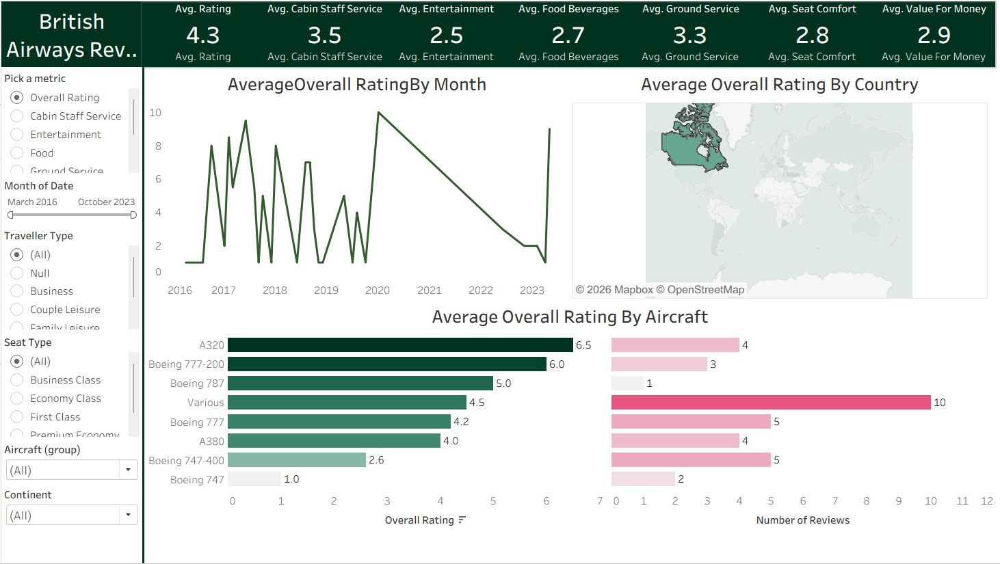

# British Airways Customer Review Dashboard (Tableau)

## Overview

This Tableau project analyzes British Airways customer review data to evaluate airline performance across multiple service dimensions.
The dashboard provides interactive visualizations to explore trends in overall ratings, aircraft performance, customer experience metrics, and geographic sentiment.

---

## Key Insights

* Customer ratings vary significantly across aircraft types, with A320 showing the highest average rating.
* Cabin staff service receives the strongest satisfaction scores compared to food, entertainment, and ground service.
* Rating trends fluctuate over time, highlighting shifts in passenger sentiment.
* Geographic analysis reveals variation in average airline ratings by country.

---

## Tools Used

* Tableau
* Data Visualization
* Customer Experience Analytics
* Business Intelligence

---

## Project Structure

dashboard/ → Tableau packaged workbook (.twbx)
data/ → Raw datasets (ba_reviews.csv, Countries.csv)
visuals/ → Dashboard preview image

---

## Skills Demonstrated

* Interactive dashboard design
* KPI visualization
* Trend analysis
* Geographic mapping
* Analytical storytelling
